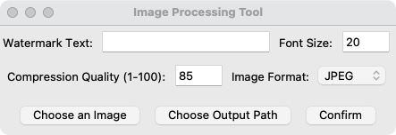

# Image-Processor-Script

## Overview

This is a Python-based image processing tool that allows users to compress images and add watermarks. It supports both a graphical user interface (GUI) and a terminal mode for user interaction.

## Features

- **Image Compression**: Compress images while maintaining quality.
- **Watermarking**: Add customizable watermarks to images.
- **Format Support**: Save images in JPEG and PNG formats.
- **Quality Control**: Adjust compression quality (1-100).
- **Font Size Control**: Customize the font size for watermarks.
- **User Modes**: Choose between GUI and terminal modes for interaction.

## Prerequisites

Before running the script, ensure you have the following Python packages installed:

- **Pillow**: A Python Imaging Library (PIL) fork that adds image processing capabilities.

You can install the required package using the following command:

```bash
pip install Pillow
```

## Running the Script

You can choose to run the script in either GUI mode or terminal mode.
```bash
python3 imageProcessor.py
```
### To run the GUI version:
1. Execute the script and select **"gui"** when prompted.

### For terminal mode:
1. Select **"terminal"** when prompted.

### In GUI Mode:
1. Click **"Choose an Image"** to select the image you want to process.
2. Click **"Choose Output Path"** to specify where to save the processed image.
3. Enter the watermark text, font size, and compression quality as needed.
4. Click **"Confirm"** to process the image. The processed image will be displayed, and a message will show the output path.
   


### In Terminal Mode:
1. Follow the prompts to enter the watermark text, compression quality, font size, input image path, and output path.
2. The processed image path will be printed after processing.

